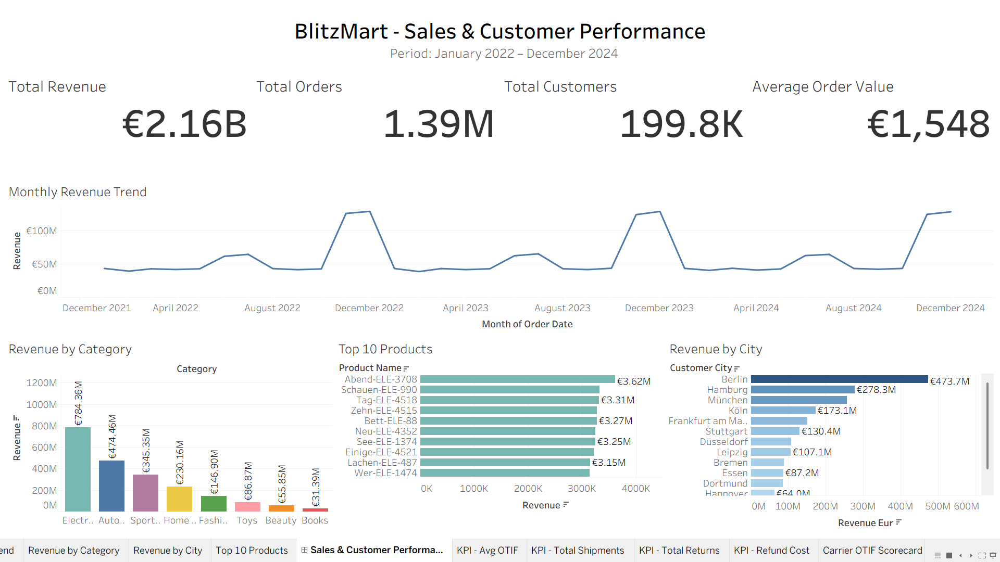
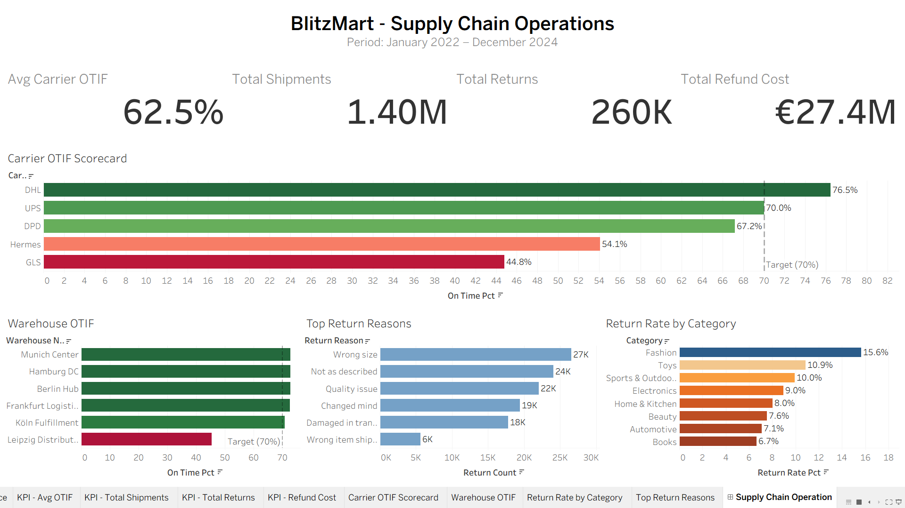

# 🛒 BlitzMart Analytics — German E-Commerce Supply Chain

> End-to-end data analytics project on a fictional German e-commerce retailer modeled after Zalando, Otto, and Amazon DE.
> **6.6M rows · 8 relational tables · SQL + Python + Tableau**

[](https://public.tableau.com/app/profile/pavan.raj.kotagiri)
[](https://www.python.org/)
[](https://duckdb.org/)

---

## 📊 Live Interactive Dashboards

| Dashboard | Focus | Link |
|---|---|---|
| **Sales & Customer Performance** | Revenue, AOV, category mix, geography | [View →](https://public.tableau.com/app/profile/pavan.raj.kotagiri/viz/BlitzMartAnalytics-GermanE-CommerceSupplyChain/SalesCustomerPerformance) |
| **Supply Chain Operations** | OTIF, warehouse performance, returns | [View →](https://public.tableau.com/app/profile/pavan.raj.kotagiri/viz/BlitzMartAnalytics-GermanE-CommerceSupplyChain/SupplyChainOperation) |




---

## 🎯 Project Overview

BlitzMart is a simulated German e-commerce retailer. This project takes raw transactional data through a complete analytics pipeline — from data generation and cleaning, through SQL and Python analysis, to interactive Tableau dashboards and business recommendations.

**The dataset spans 2022–2024:** 1.5M orders generated (1.39M delivered), 
~200K customers....

---

## 🔑 Key Findings

| # | Finding | Business Impact |
|---|---|---|
| 1 | **€2.16B revenue**, AOV €1,548, with Nov/Dec running **3× higher** than off-season | Q4 is the make-or-break quarter — capacity must scale 3× |
| 2 | **36% of SKUs drive 80% of revenue** (ABC analysis) | A-class products need tight stock control & premium logistics |
| 3 | **Top 20% of customers = 38% of revenue** | Retention spend should skew heavily to this segment |
| 4 | **31.7-point OTIF gap**: DHL 76.5% vs GLS 44.8% | Consolidating volume to DHL → ~80K fewer late deliveries/year |
| 5 | **Leipzig warehouse at 45.4% OTIF** vs Berlin 72.8% | Clear operational outlier — invest or reroute East orders |
| 6 | **Fashion returns 15.6%** vs Books 6.7%; "Wrong size" = 23% of all returns | Sizing guide investment attacks the #1 cost lever |
| 7 | **Forecast accuracy 91–94%** across all categories | Demand planning is healthy — focus on fulfillment, not forecasts |
| 8 | **Berlin + Hamburg + München = 47% of revenue** | Marketing & warehouse capacity should reflect this skew |

📄 **[Read the full Business Insights report →](BUSINESS_INSIGHTS.md)**

---

## 🛠️ Tech Stack

| Layer | Tools |
|---|---|
| **Data generation & cleaning** | Python, pandas, NumPy, Faker |
| **SQL analysis** | DuckDB (PostgreSQL-compatible syntax) |
| **Python analysis** | pandas, matplotlib, seaborn |
| **Visualization** | Tableau Public |
| **Environment** | Google Colab |

---

## 📁 Repository Structure

```
blitzmart-analytics/
├── README.md                            # You are here
├── BUSINESS_INSIGHTS.md                 # Full findings + recommendations
├── notebooks/
│   ├── BlitzMart_01_DataGeneration.ipynb   # Data gen + ETL cleaning pipeline
│   ├── BlitzMart_02_SQL_Analysis.ipynb     # 15 business SQL queries
│   └── BlitzMart_03_Python_Analysis.ipynb  # ABC, OTIF, demand, forecast analysis
├── sql/
│   └── analysis_queries.sql             # All 15 queries as standalone SQL
├── images/
│   ├── dashboard_sales.png
│   └── dashboard_supplychain.png
└── data/
    └── README.md                        # Data dictionary + schema
```

---

## 🔬 Methodology

### 1. Data Generation
Generated 6.6M rows across 8 relational tables with realistic business patterns:
- Population-weighted customer distribution across German cities
- Carrier performance gaps modeled on real German market data (DHL, Hermes, DPD, UPS, GLS)
- Category-specific return rates (Fashion high, Books low)
- Seasonal demand (3× Nov/Dec spike)

### 2. ETL & Data Cleaning
Built a cleaning pipeline that detected and resolved **~29,000 data quality issues**:
- Missing values (imputation)
- Duplicate keys (deduplication)
- Invalid quantities & prices (removal)
- Impossible date logic (removal)
- Statistical outliers (IQR-based capping)
- Referential integrity repair

### 3. SQL Analysis (15 queries)
Including window functions (`LAG`, `NTILE`, `ROW_NUMBER`), CTEs, RFM segmentation, and cohort retention analysis.

### 4. Python Analysis (12 techniques)
ABC analysis (products + customers), OTIF carrier scorecard, demand seasonality, forecast accuracy, return root-cause analysis, geographic concentration.

### 5. Tableau Dashboards
Two interactive dashboards — one for commercial stakeholders, one for operations.

---

## 📈 Sample Insights Visualized

**Carrier OTIF Performance** — the 31.7-point gap between DHL and GLS is the headline supply chain finding. GLS delivers on-time less than half the time, well below the 70% industry benchmark.

**Leipzig Warehouse Outlier** — while five warehouses cluster around 71–73% OTIF, Leipzig sits isolated at 45.4%, dragging down the entire East region's customer experience.

**Return Patterns** — Fashion's 15.6% return rate (vs 6.7% for Books) combined with "Wrong size" being 23% of all returns points to a clear, actionable investment: better sizing tools.

---

## 👤 Author

**Pavan Raj Kotagiri**
Data Analyst | Business Analyst | Supply Chain Analytics

- 📊 [Tableau Public](https://public.tableau.com/app/profile/pavan.raj.kotagiri)
- 💼 [LinkedIn](https://www.linkedin.com/in/pavanrajkotagiri/)

---

## 📝 Notes

The raw CSV files (~250 MB) are not included in this repo due to size. The data generation notebook (`BlitzMart_01_DataGeneration.ipynb`) reproduces the full dataset from scratch. See [`data/README.md`](data/README.md) for the schema and data dictionary.

*This is a portfolio project using synthetic data. BlitzMart is fictional; business patterns are benchmarked against publicly known German e-commerce and logistics operations.*
