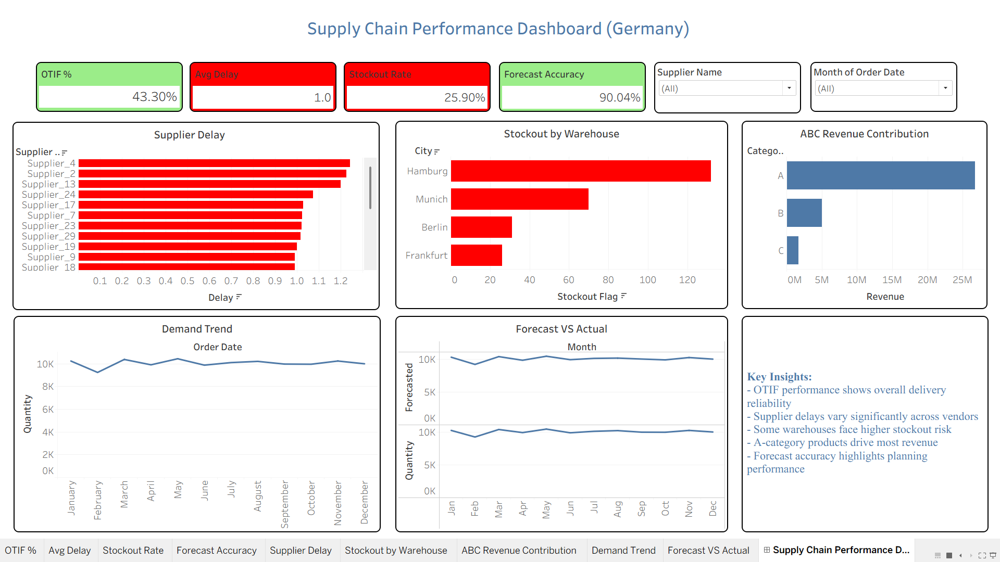

# 🇩🇪 Germany Supply Chain Performance Dashboard

## 📌 Overview

This project analyzes supply chain performance across Germany using real-world logistics metrics. The goal is to identify delivery inefficiencies, stockout risks, supplier delays, and forecasting performance.

---

## 🎯 Business Problem

Companies struggle with:

* Late deliveries (low OTIF)
* Inventory stockouts
* Supplier delays
* Poor demand planning

This project provides a data-driven solution to monitor and improve these areas.

---

## 📊 Dataset

Synthetic but realistic dataset simulating:

* Orders & shipments
* Supplier performance
* Inventory levels
* Forecast vs actual demand

---

## 🛠️ Tools Used

* SQL → Data extraction & aggregation
* Python (Pandas, NumPy) → Data cleaning & feature engineering
* Tableau → Dashboard & visualization

---

## 📈 Key KPIs

* OTIF % (On-Time In-Full Delivery)
* Average Delay (Days)
* Stockout Rate
* Forecast Accuracy

---

## 📊 Dashboard Highlights

* Supplier Delay Analysis → Identifies worst-performing vendors
* Stockout by Warehouse → Detects inventory risk locations
* ABC Revenue Contribution → Shows Pareto (80/20) effect
* Demand Trend → Monthly demand pattern
* Forecast vs Actual → Planning accuracy comparison

---

## 🔍 Key Insights

* OTIF at 43% → significant delivery reliability issue
* Hamburg warehouse shows highest stockout risk
* Supplier_4 and Supplier_2 drive major delays
* A-category products contribute ~80% of total revenue
* Forecast accuracy ~90% → planning strong, execution weak

---

## 📌 Business Impact

* Helps reduce delivery delays
* Improves inventory planning
* Identifies supplier risks
* Supports data-driven supply chain decisions

---

## 📷 Dashboard Preview



---

## 🚀 How to Use

1. Open `.twbx` file in Tableau Public/Desktop
2. Connect to provided CSV datasets
3. Interact with filters (Supplier, Month)

---

## 📂 Project Structure

```
data/ → cleaned datasets  
dashboard/ → Tableau file + image  
notebook/ → Python analysis  
README.md → project documentation  
```

---

## ✅ Outcome

Built an end-to-end analytics project simulating real business use case:
Data → Analysis → Insights → Dashboard
